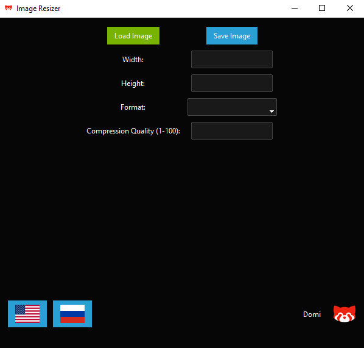

# Image Resizer

 **Image Resizer**

**Image Resizer** - это простое и удобное приложение для изменения размеров изображений, конвертации их в разные форматы и настройки качества сжатия. Поддерживаются форматы JPEG, PNG, BMP, GIF и TIFF. Программа также позволяет переключаться между английским и русским языками.

## Основные особенности

- Загрузка и сохранение изображений в различных форматах.
- Изменение размеров изображений.
- Настройка качества сжатия изображений.
- Поддержка нескольких языков (английский и русский).
- Визуальный предпросмотр изменений в реальном времени.

## Скриншоты

### Главный экран

### Предпросмотр изображения

 

## Установка и запуск

1. Скачайте и запустите .exe файл.

## Использование

1. Нажмите на кнопку "Load Image" для загрузки изображения.
2. Измените размеры изображения, выбрав новые ширину и высоту.
3. Выберите формат файла и настройте качество сжатия.
4. Нажмите "Save Image" для сохранения измененного изображения.
5. Используйте кнопки языков в левом нижнем углу для переключения между английским и русским языками.

## Языки

  
 

## Лицензия

Этот проект лицензируется под MIT License. См. [LICENSE](LICENSE) для подробностей.

## Контрибуторы

- **Domi** - Автор и разработчик

## Контакты

Если у вас есть вопросы или предложения, вы можете связаться со мной по [kononvich.87@list.ru](mailto:kononvich.87@list.ru).

---

**Image Resizer** - Простой и мощный инструмент для управления изображениями.
